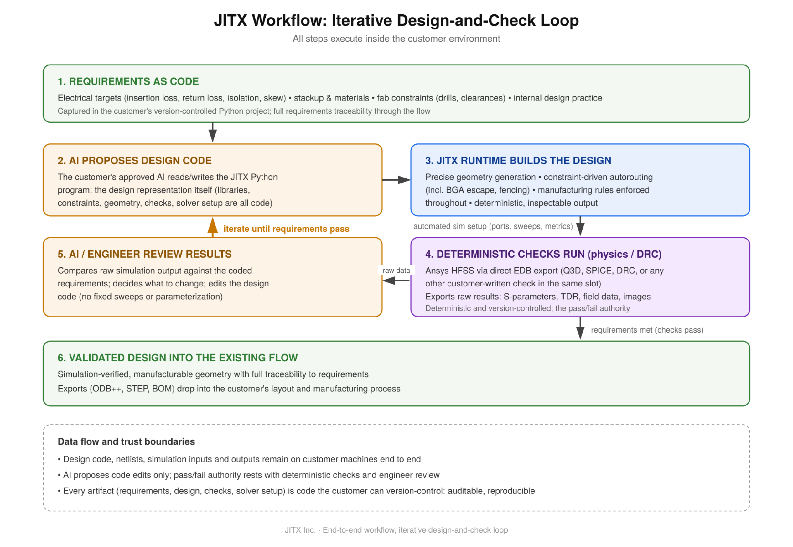
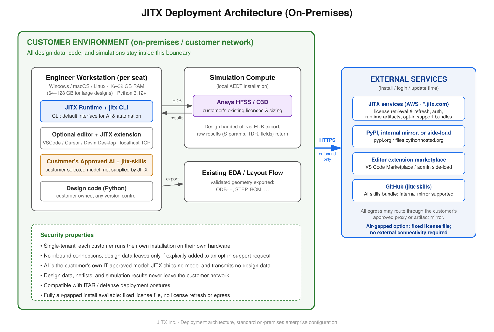

# JITX Architecture and Systems Requirements

August 2026 · Version 2.0

JITX is on-premises software: it installs on customer machines, keeps all design data inside the customer environment, and uses customer-provided simulation tools and the customer's own approved AI assistant. The JITX runtime has no hosted backend. JITX-operated cloud services, hosted on AWS, are limited to licensing and authentication, software distribution and update checks, and opt-in support-bundle upload; they do not process customer design data. Fully air-gapped and node-locked installations with a fixed license file are available. The end-to-end design workflow, including the simulation loop, is described in [Appendix A](#appendix-a-workflow-architecture).

---

## 1. Deployment architecture

Design execution, simulation, AI assistance, and project data remain inside the customer environment. JITX provides no hosted processing of customer designs and requires no inbound connectivity or customer-side server clusters, load balancers, or databases. Capacity scales by engineer seat.

**Engineer workstations (per seat).** Each workstation runs the JITX runtime and `jitx` CLI with Python 3.12+ in the project virtual environment; the CLI is the default interface used by the customer's AI assistant and automation tools. An editor is optional — VSCode or a VSCode-based equivalent (Cursor, Devin Desktop) can run the JITX extension. When an editor is used, the runtime communicates with it over a **TCP socket bound to `localhost`**. This is neither a Unix file-based socket nor a Windows named pipe: local firewall rules must allow TCP connections to `localhost`, and the socket is not exposed on external interfaces.

**Simulation compute.** Ansys HFSS / Q3D runs under the customer's existing licenses as a local AEDT installation on the engineer's workstation. Designs are handed off through EDB export, and raw results return to the workstation. If the customer offloads Ansys solves to a compute farm, that is configured in AEDT itself; JITX always drives the local AEDT installation.

**AI assistant.** JITX does not bundle an AI. The customer's IT-approved assistant writes JITX design code using the open `jitx-skills` bundle.

Required network egress is **outbound HTTPS only**, directly or through the customer's approved proxy or internal mirrors:

| Destination (outbound HTTPS only) | Purpose |
| --- | --- |
| JITX services (`*.jitx.com`, hosted on AWS) | Licensing and authentication (license retrieval and refresh), runtime artifact download and update checks, opt-in support-bundle upload. No customer design data. Not used in air-gapped or node-locked installations (fixed license file). |
| PyPI (`pypi.org`, `files.pythonhosted.org`) | JITX Python packages; an internal artifact mirror (Artifactory, Nexus, DevPI) is supported as well, and packages can be side-loaded directly without index access. |
| Editor extension marketplace | VS Code Marketplace; administrator side-load is supported as an alternative. |
| GitHub (`github.com/JITx-Inc/jitx-skills`) | Open AI-skills bundle for the customer's assistant; can be mirrored internally. |

After installation, the only recurring dependency required for operation is the HTTPS license refresh against the JITX services endpoint. Automatic update checks occur but are non-blocking — operation does not depend on them succeeding. Air-gapped and node-locked installations use a fixed license file instead and have no recurring dependency.

*Figure 1. Deployment architecture: standard on-premises enterprise configuration.*

---

## 2. AI model access

The customer's approved AI operates on JITX design code, which is open Python. JITX does not require, bundle, or host any AI/ML model.

- The customer selects the model from the organization's approved list. Cloud-hosted and on-premises models are supported when the customer approves them. JITX does not call model APIs directly; compatibility requires only that the customer's assistant can edit Python project files and invoke the `jitx` CLI.
- The assistant receives the design code and the context the engineer provides. That information goes only to the model the customer selected; **JITX itself does not transmit design data.**
- The open `jitx-skills` bundle provides the chosen model with skill and documentation content for writing correct JITX Python, and can be mirrored internally.
- Inference compute comes from the customer's existing AI provisioning, through an API agreement or on-premises deployment. JITX adds no GPU or model-hosting requirements.
- JITX's own engines (autorouter, constraint engine, geometry generation) are conventional deterministic algorithms and contain no ML models.
- The customer's own Ansys solver runs are the compute-intensive element of the design workflow described in [Appendix A](#appendix-a-workflow-architecture).

---

## 3. Cloud provider requirements

The customer needs no AWS or GCP resources; JITX runs on customer hardware and has no cross-cloud dependencies.

- **Customer side:** none. The solution runs on-premises on customer hardware.
- **JITX side:** the JITX runtime has no hosted backend and executes entirely on the customer's machines. JITX-operated cloud services, hosted on AWS, are limited to licensing and authentication (license retrieval and refresh), software distribution and update checks, and opt-in support-bundle upload. Customer design data does not transit these services unless the customer explicitly chooses to include it in a support request.
- **Cross-cloud dependencies:** none.
- **Data residency:** design data, netlists, simulation inputs and outputs, and design code remain in the customer environment. Because design data never leaves the customer network, the deployment model supports restricted environments, including defense and ITAR-constrained programs.
- **Air-gapped operation:** a fully air-gapped installation is available. It uses a fixed license file that requires no refresh token, with package, extension, and skills sources served from internal mirrors; no internet connectivity is required in this configuration.
- **Node-locked licensing:** available. From the JITX side it uses the same mechanism as the air-gapped option — a fixed license file with no refresh token.

---

## 4. Solution classification

JITX is on-premises licensed software sold as an annual per-seat subscription. It is not a SaaS offering.

- **Tenancy model:** the customer design and runtime environment is single-tenant. Each customer runs its own installation on its own machines, with no shared design runtime and no shared data plane.
- **Service boundaries:** the only JITX-operated services the deployment touches are authentication/licensing, software update distribution, and opt-in support-bundle upload. Design work, simulation, and AI assistance all execute inside the customer boundary.

---

## 5. Server / storage / database requirements

JITX runs on standard workstation hardware, with no database or HA/DR infrastructure to provision.

| Item | Requirement |
| --- | --- |
| Operating system | Windows, macOS, or Linux. The JITX runtime installs automatically per platform. On macOS and Linux it installs to a per-user location. On Windows the install is split: the binary goes to `\Program Files (x86)` and configuration files go to the user directory; the binary install may require administrator privilege depending on machine configuration. |
| CPU | Modern multi-core CPU; standard workstation-class requirements. Large designs are constrained by memory (heap allocation) before CPU or disk. |
| Memory | 16–32 GB RAM for routine designs; 64–128 GB for large designs (many component pins or high layer count), with the JITX heap allocation raised accordingly. Guidance per the JITX Memory Usage Application Note; final sizing depends on pin and layer count. |
| Disk | Several GB free for the runtime, the project virtual environment, and the Python package cache. No special IOPS requirements. |
| Python | Python 3.12 or newer, used by the `jitx` CLI via the project virtual environment. |
| Simulation compute | Governed by the customer's existing Ansys HFSS / Q3D sizing practice. JITX imposes no requirement beyond what the simulation tools already run on. |
| Database | None. JITX installs no database; no HA/DR infrastructure is required beyond normal workstation and file backup practice. |

For large designs, heap allocation is raised through the `JITX_INTERACTIVE_MAX_HEAP_SIZE` and `STANZA_MAX_HEAP_SIZE` environment variables; the JITX Memory Usage Application Note covers the procedure. JITX project files are plain Python code and are typically kept in the customer's version-control system; git is not required. Simulation artifacts follow the customer's existing Ansys data-management practice.

---

## Appendix A. Workflow architecture

JITX runs an iterative design-and-check workflow. The design is an ordinary Python program — correctness requirements are expressed as inspectable, version-controlled checks. The customer-approved assistant proposes edits to the design code; deterministic checks, simulations, and engineer review determine whether the requirements are met, and failing checks guide the next edit. All steps execute on customer machines.

1. **Requirements captured as code:** electrical targets (insertion loss, return loss, isolation, skew), stackup and materials, fabrication constraints, and internal design practice.
2. **The customer's AI writes and edits the JITX Python design program.** The source-of-truth design representation is Python code: libraries, constraints, geometry, and checks are all code. Generated artifacts are exported to simulation and downstream EDA tools.
3. **The JITX runtime builds the design:** it generates geometry, autoroutes constrained structures (including BGA escape and via fencing), and enforces configured manufacturing rules.
4. **Simulation setup** (ports, sweeps, metrics) is generated from the requirements encoded in the JITX project and exported directly to HFSS via EDB.
5. **Checks run:** HFSS (or Q3D, SPICE, DRC, or any other customer-written check in the same slot) exports raw results such as S-parameters, TDR, and field data.
6. **Review and iterate:** the assistant or engineer reviews the raw results against the requirements and edits the design code; the workflow repeats until the checks pass.
7. **Export:** the validated, manufacturable geometry exports into the customer's existing EDA flow — ODB++, STEP, and BOM outputs.

The checks are code artifacts that can be kept under the customer's version control and audit process. JITX does not require git or any particular VCS.

*Figure A1. End-to-end workflow: the iterative design-and-check loop.*

---

## Document history

| Version | Date | Changes |
| --- | --- | --- |
| 1.0 | 2026-08-04 | Initial release. |
| 1.1 | 2026-08-05 | Licensing and air-gapped installation details added. |
| 1.2 | 2026-08-06 | Clarifications from engineering review. |
| 1.3 | 2026-08-07 | Windows installation details, editor and network clarifications, and document history added. |
| 1.4 | 2026-08-07 | Editorial and diagram corrections. |
| 1.5 | 2026-08-07 | Workflow architecture moved to Appendix A; node-locked licensing added. |
| 1.6 | 2026-08-07 | Wording and scope clarifications. |
| 1.7 | 2026-08-07 | Consistency edits. |
| 1.8 | 2026-08-07 | Clarified automation, licensing, and compatibility language. |
| 1.9 | 2026-08-07 | Editorial pass for voice and clarity. |
| 2.0 | 2026-08-07 | Removed Additional reference section. |
